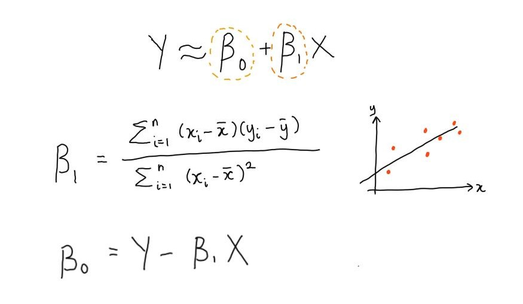

Introduction to exponents in R and Python
================

  - [Algebraic rules for exponents](#algebraic-rules-for-exponents)
      - [Using exponents in R](#using-exponents-in-r)
      - [Using exponents in Python](#using-exponents-in-python)
      - [Algebraic identities](#algebraic-identities)
  - [Exponential functions](#exponential-functions)
      - [Exponential functions in R](#exponential-functions-in-r)
          - [Case study 1: Least squares coefficient estimates for
            simple linear
            regression](#case-study-1-least-squares-coefficient-estimates-for-simple-linear-regression)
      - [Exponential functions in
        Python](#exponential-functions-in-python)
          - [Case study 2: Modelling coronovirus
            growth](#case-study-2-modelling-coronovirus-growth)
  - [The natural exponential
    function](#the-natural-exponential-function)

# Algebraic rules for exponents

The rules for solving algebraic equations using exponents are listed
below.


## Using exponents in R

Exponents are annotated using `^` in R.

``` r
#-----calculating exponents in R-----
(2 ^ 4) * (2 ^ 12) == 2 ^ 16
#> [1] TRUE

(2 ^ 4) / (2 ^ 12) == 2 ^ -8 
#> [1] TRUE

(2 ^ 4) ^ 12 == 2 ^ 48 
#> [1] TRUE  

(2 * 4) ^ 2 == (2 ^ 2) * (4 ^ 2)
#> [1] TRUE 
```

Increasing the power of a base number greatly increases the resulting
value (how greatly the values increase will be covered later under the
derivatives rule).

``` r
#-----visualising relationship between base number and power in R-----
base_numbers <- c(seq(from = 1,
                      to = 50,
                      by = 1))  

power <- c(1, 2, 3, 4, 5, 10)

# use expand.grid to compute every possible combination of 2 factors of vectors  

power_table <- expand.grid(base_numbers,
                           power) %>%
  rename(base_numbers = "Var1",
         power = "Var2") %>%
  mutate(values = base_numbers ^ power)
  
# create facet plot labels
facet_labels <- c("1" = "x^1",
                  "2" = "x^2",
                  "3" = "x^3",
                  "4" = "x^4",
                  "5" = "x^5",
                  "10" = "x^10")

# graph using ggplot2 with power as a facet

power_table %>%
  ggplot(aes(x = base_numbers,
             y = values)) +
  geom_line() +
  facet_wrap(~ power,
             scales = "free",
             labeller = as_labeller(facet_labels)) + 
  labs(title = "Relationship between base numbers and increasing power values",
       x = "Base numbers",
       y = "Values")  
```


## Using exponents in Python

**Notes:**

  - Base Python has an integer type that allows the calculation of very
    large numbers i.e. `50 ** 50`.
  - However, Python numpy arrays and pandas data frames are underwritten
    in C and cannot handle very large calculations.  
  - In R, the integer/numeric class holds true for values, vectors or
    data frames.

<!-- end list -->

``` python
#-----calculating exponents in Python----- 
(2 ** 4) * (2 ** 12) == 2 ** 16
#> True

(2 ** 4) / (2 ** 12) == 2 ** -8 
#> True 

(2 ** 4) ** 12 == 2 ** 48 
#> True  

(2 * 4) ** 2 == (2 ** 2) * (4 ** 2)
#> True
```

``` python
#-----visualising relationship between base number and power in Python-----
import numpy as np
import pandas as pd
import matplotlib.pyplot as plt
import seaborn as sns

base_number = np.arange(start = 1, stop = 50 + 1, step = 1)
power = np.array([1, 2, 3, 4])

def expand_grid(x, y):
  xG, yG = np.meshgrid(x, y) # xG for 1st array (x) and yG for 2nd array (y)
  xG = xG.flatten() # make the grid 1d
  yG = yG.flatten() # same
  return pd.DataFrame({"base_number":xG, "power":yG})

power_table = expand_grid(base_number, power) 
 
power_table = power_table.assign(value = power_table["base_number"] ** power_table["power"])  

# create graphs of base_number vs power

sns.set(style = "white")

g = sns.FacetGrid(power_table,
                  hue = "power",
                  col = "power",
                  col_wrap = 2,
                  sharey = False) # do not share the same y-axis

g.map_dataframe(sns.lineplot,
     x = "base_number",
     y = "value")

plt.show()
```


## Algebraic identities

The following equalities are called entities as they are true for all
real values of  and
.


# Exponential functions

## Exponential functions in R

### Case study 1: Least squares coefficient estimates for simple linear regression

In simple linear regression (), the values of

and  are chosen as such to minimise the residual sum or squares
(RSS).



``` r
#-----example dataset from data:trees-----
data <- datasets::trees

# treat girth as the x variable and volume as the y variable

data %>%
  ggplot(aes(x = Girth, 
             y = Volume)) + 
  geom_point() + 
  expand_limits(x = 0,
                y = 0) + 
  labs(title = "Plot of girth versus volume of trees")
```

<!-- -->


``` r
#-----build simple linear regression model-----

model <- lm(Volume ~ Girth, data = data)
summary(model)
```

    ## 
    ## Call:
    ## lm(formula = Volume ~ Girth, data = data)
    ## 
    ## Residuals:
    ##    Min     1Q Median     3Q    Max 
    ## -8.065 -3.107  0.152  3.495  9.587 
    ## 
    ## Coefficients:
    ##             Estimate Std. Error t value Pr(>|t|)    
    ## (Intercept) -36.9435     3.3651  -10.98 7.62e-12 ***
    ## Girth         5.0659     0.2474   20.48  < 2e-16 ***
    ## ---
    ## Signif. codes:  0 '***' 0.001 '**' 0.01 '*' 0.05 '.' 0.1 ' ' 1
    ## 
    ## Residual standard error: 4.252 on 29 degrees of freedom
    ## Multiple R-squared:  0.9353, Adjusted R-squared:  0.9331 
    ## F-statistic: 419.4 on 1 and 29 DF,  p-value: < 2.2e-16

``` r
#> Call:
#> lm(formula = Volume ~ Girth, data = data)
#> 
#> Residuals:
#>    Min     1Q Median     3Q    Max 
#> -8.065 -3.107  0.152  3.495  9.587 
#> 
#> Coefficients:
#>            Estimate Std. Error t value Pr(>|t|)    
#> (Intercept) -36.9435     3.3651  -10.98 7.62e-12 ***
#> Girth         5.0659     0.2474   20.48  < 2e-16 ***
#> ---
#> Signif. codes:  0 ‘***’ 0.001 ‘**’ 0.01 ‘*’ 0.05 ‘.’ 0.1 ‘ ’ 1
#> 
#> Residual standard error: 4.252 on 29 degrees of freedom
#> Multiple R-squared:  0.9353, Adjusted R-squared:  0.9331 
#> F-statistic: 419.4 on 1 and 29 DF,  p-value: < 2.2e-16 

# we can visualise this simple linear regression model 

data %>% 
  ggplot(aes(x = Girth, y = Volume)) +
  geom_point() +
  stat_smooth(method = "lm", col = "firebrick") +
  expand_limits(x = 0,
                y = 0) + 
  labs(title = "Simple linear model fitted to data")
```

<!-- -->

## Exponential functions in Python

### Case study 2: Modelling coronovirus growth

# The natural exponential function
